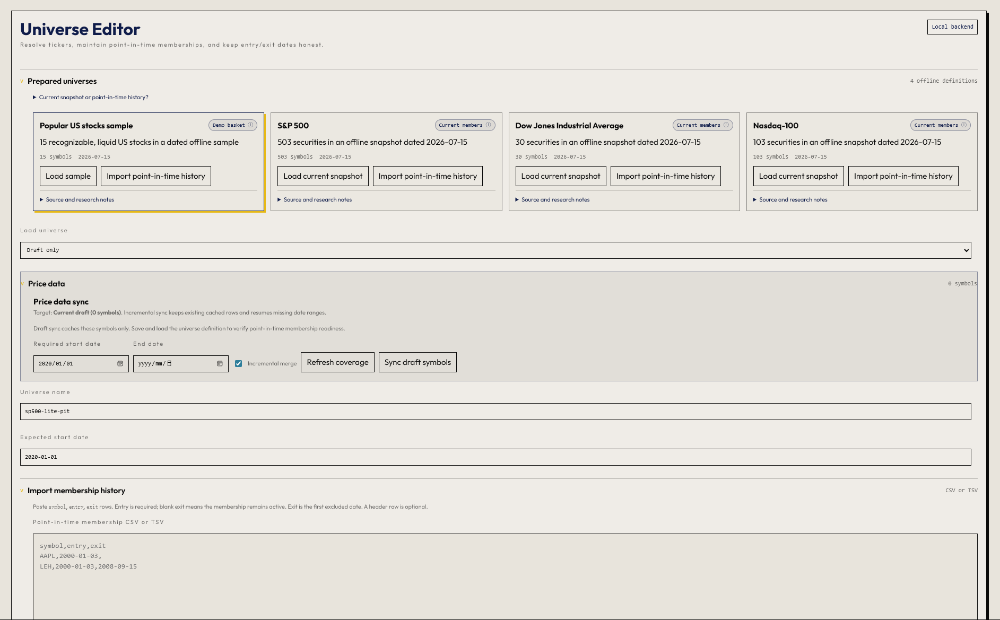
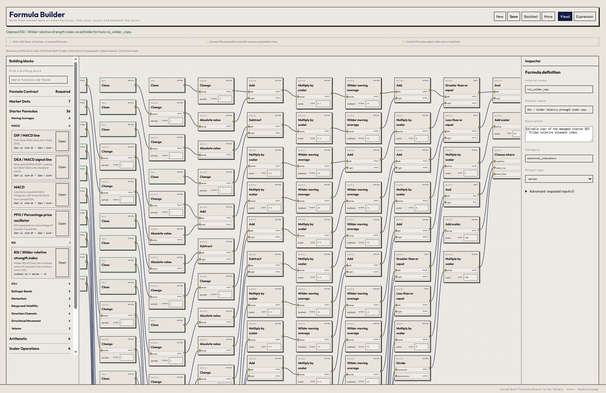
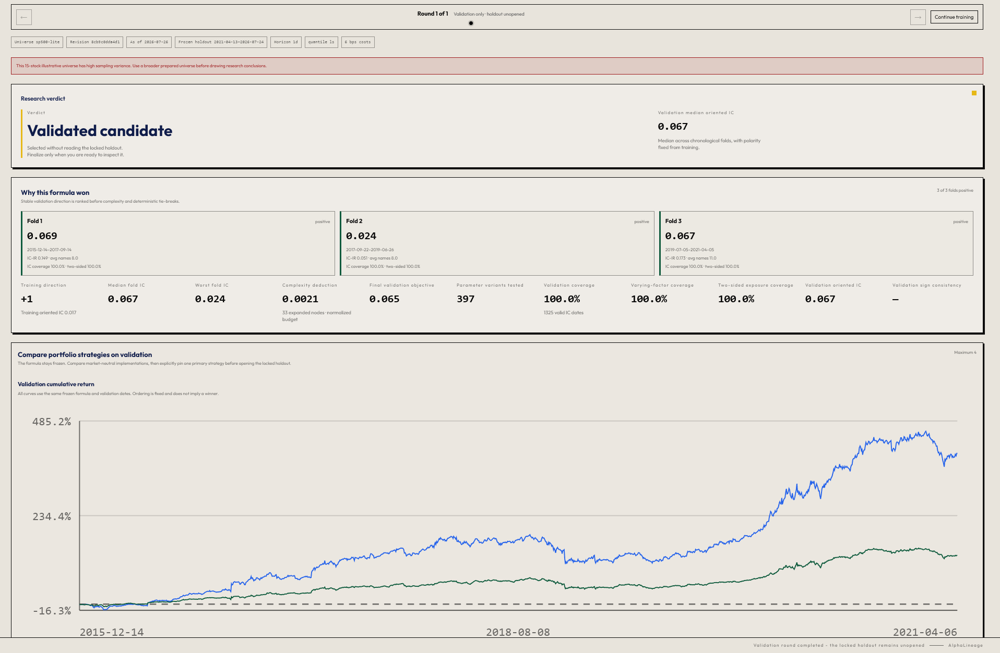
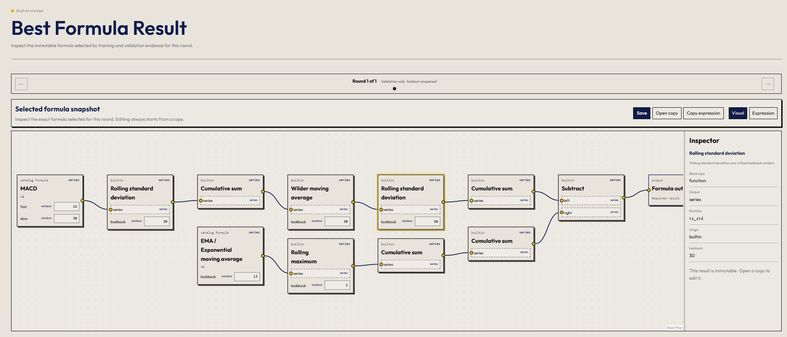
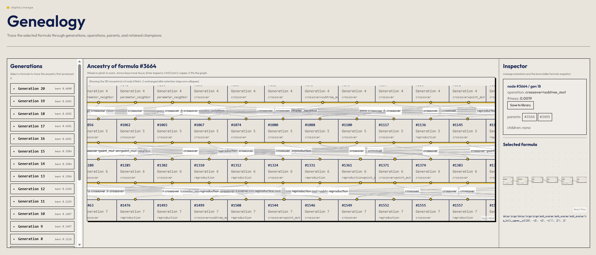

# AlphaLineage

> A local-first visual research workbench for building, evolving, validating, and inspecting
> quantitative formulas.

AlphaLineage combines a reusable formula system, deterministic genetic programming, chronological
validation, market-neutral backtesting, and lineage inspection in one browser interface. It is
designed for researchers who want to understand **what was searched, why a formula was selected,
and when holdout evidence was opened**—not just receive an unexplained backtest number.

The Python package is `alphalineage`. For a guided walkthrough, see
[the tutorial](docs/TUTORIAL.md).

## What it provides

| Area | Capabilities |
| --- | --- |
| Formula research | Strongly typed visual graphs, reusable formulas, pinned revisions, inline parameters, and a managed technical-indicator catalog |
| Evolution | Deterministic genetic programming with protected stepping stones, parameter neighborhoods, formula composition, checkpoint continuation, and bounded multicore native scoring |
| Validation | Three chronological folds, fixed training polarity, coverage and portfolio-feasibility gates, and explicit strategy comparison |
| Backtesting | Quantile long/short and rank-proportional portfolios, transaction costs, benchmark overlays, and invalid/no-exposure detection |
| Evidence control | Validation-only rounds, user-pinned finalization plans, immutable results, and clearly labelled repeated holdout reads |
| Data | Prepared S&P 500, DJIA, and Nasdaq-100 snapshots, custom point-in-time memberships, incremental price synchronization, and data-integrity checks |

The research flow is deliberately staged:

```text
Universe + reusable formulas
            ↓
Deterministic evolutionary search
            ↓
Three chronological validation folds
            ↓
User-pinned portfolio strategy
            ↓
Explicit locked-holdout finalization
            ↓
Immutable result, formula graph, and genealogy
```

## Product tour

### 1. Prepare a research universe

Load a bundled current snapshot for quick exploration, or import dated point-in-time membership
history when survivorship bias matters. Price coverage and synchronization live beside the universe
definition so readiness is visible before training begins.

<p align="center">
  
</p>

### 2. Build formulas from formulas

The Formula Builder uses the same typed expression model as training and backtesting. Market fields,
built-in operators, starter indicators, and saved formulas are composable blocks. A formula can be
saved, nested inside another formula, backtested as a draft, or opened as an editable copy.

<p align="center">
  
</p>

### 3. Validate before opening the holdout

Completed training rounds remain validation-only until the user explicitly finalizes one. The
Metrics page explains why the candidate won, shows fold-by-fold stability and coverage, and compares
up to four predeclared portfolio strategies without automatically selecting the best-looking curve.

<p align="center">
  
</p>

<sub>Example research output only. The chart is validation evidence, not a claim of future or live
investment performance.</sub>

### 4. Inspect the exact selected formula

The Best Formula Result page reuses the Formula Builder's graph language in read-only mode. It shows
the oriented expression, inline values, managed-formula revisions, and node-level definitions while
keeping the immutable result separate from editable copies.

<p align="center">
  
</p>

### 5. Trace how the formula evolved

Genealogy connects the selected result to crossover, mutation, parameter-neighbor, composition, and
retained-champion events. The generation list, ancestry canvas, and read-only formula inspector stay
synchronized so a result can be audited from metric back to expression.

<p align="center">
  
</p>

## Why AlphaLineage is different

- **Formulas are reusable research objects.** A saved MACD, RSI, or custom expression can become a
  building block in a larger formula while its dependency revisions remain pinned.
- **Evolution can cross weak intermediate states.** Aggressive exploration protects diverse niches,
  searches parameter frontiers, composes complete formulas, and occasionally applies two edits
  before scoring.
- **Validation and holdout have different jobs.** Training and chronological validation select the
  candidate; the locked holdout is opened only through an explicit finalization plan.
- **A flat line is not automatically evidence.** Constant factors, insufficient coverage,
  nonfinite values, non-neutral portfolios, and cash-only paths are rejected or labelled
  unavailable rather than presented as meaningful 0% performance.
- **Runs are reproducible and inspectable.** Native worker counts do not change the evolutionary
  trajectory, the pure-Python fallback remains deterministic and serial, completed rounds are
  immutable, and continuation resumes the latest checkpoint.
- **Research stays local.** The FastAPI backend, React UI, cached data, sessions, formulas, and
  results run on the user's computer.

## Quick start

### Windows launcher

Requires Python 3.11+, Node 20+, and the backend dependencies installed once:

```powershell
python -m venv .venv
.\.venv\Scripts\Activate.ps1
pip install -e ".[dev]"
.\start.cmd
```

After that one-time setup, the launcher installs missing frontend packages, builds the UI, starts
the API and web app at
[http://localhost:8000](http://localhost:8000), and opens a browser. Use **Quit** in the application
header or press `Ctrl+C` in the launcher terminal to stop it.

### Docker

```bash
git clone https://github.com/CatBot-3/AlphaLineage---alpha-factor-with-genetics.git
cd AlphaLineage---alpha-factor-with-genetics
cp .env.example .env       # optional: add a Tiingo API key
docker compose up --build
```

Open [http://localhost:8000](http://localhost:8000). Cached market data, universes, formulas,
sessions, and results persist under `./data_cache/`.

### Development setup

Backend:

```powershell
python -m venv .venv
.\.venv\Scripts\Activate.ps1
pip install -e ".[dev]"
Copy-Item .env.example .env    # optional
uvicorn alphalineage.api.app:app --env-file .env --port 8000
```

Frontend, in a second terminal:

```powershell
cd frontend
npm install
npm run dev:app
```

Open [http://localhost:5173](http://localhost:5173).

For Linux or macOS, activate the environment with `source .venv/bin/activate` and copy the
environment template with `cp .env.example .env`.

### Static demo

The demo build renders a bundled completed run without a backend:

```bash
cd frontend
npm run build:demo
npm run preview
```

For a saved workspace that contains a finalized report, regenerate its demo data with:

```bash
python scripts/export_demo.py --workspace run-<id> --out frontend/public/demo-run.json
```

## A first research run

1. Open **Extend → Universe Editor**, load a prepared universe, and synchronize any missing prices.
2. Optionally use **Extend → Formula Builder** to create or reuse a formula.
3. Open **Train**, select the universe, search budget, enabled formulas, and resource profile.
4. Review the completed validation round in **Metrics**.
5. Compare portfolio strategies and explicitly pin the primary strategy.
6. Finalize only when ready to open the locked holdout.
7. Inspect the immutable result in **Best Formula Result** and its ancestry in **Genealogy**.
8. Continue from the latest checkpoint or save it as a **Formula Result** in the **Library**.

## Architecture

- **Research engine:** Python, NumPy, pandas, SciPy
- **API and jobs:** FastAPI with persisted sessions, checkpoints, rounds, and finalizations
- **Frontend:** React, TypeScript, Vite, React Flow
- **Acceleration:** optional packaged C++ evaluator with deterministic bounded multicore scoring
- **Storage:** local Parquet market-data caches and revisioned JSON artifacts

## Quality gates

```bash
pytest -q
ruff check .
ruff format --check .
mypy src

cd frontend
npm run typecheck
npm test
npm run build:app
```

Release builds can additionally verify packaged resources and the native evaluator with:

```bash
python -m alphalineage.smoke
```

## Data notes

Bundled current-index snapshots are convenient static universes: they apply one membership snapshot
across the chosen period and are therefore survivorship-biased. For historically honest membership,
import point-in-time entry and exit dates. Market data is cached under `data_cache/`; Tiingo can be
configured in `.env`, with yfinance available as a fallback.

## Disclaimer

AlphaLineage is for research and educational use only. It is **not investment advice**, a brokerage,
or a recommendation to buy or sell any security. Backtests and validation results do not guarantee
future performance.
